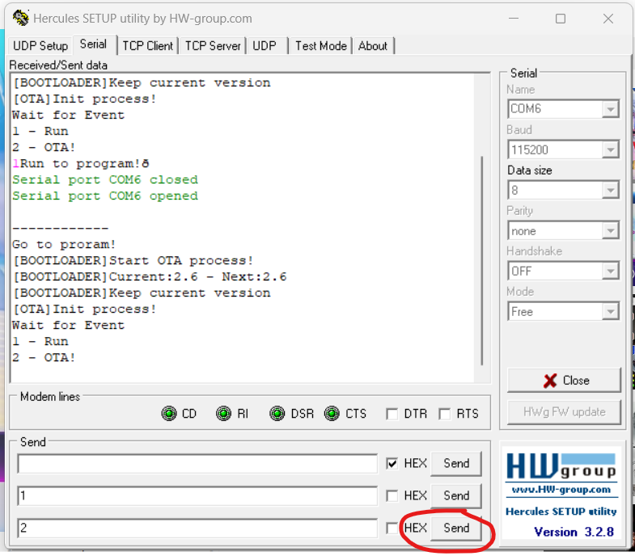
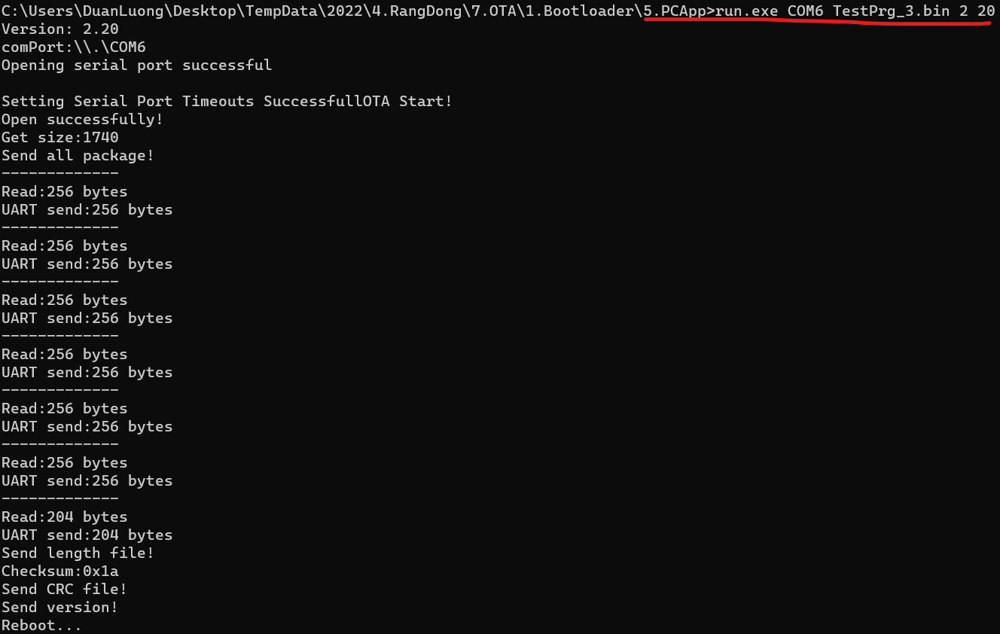
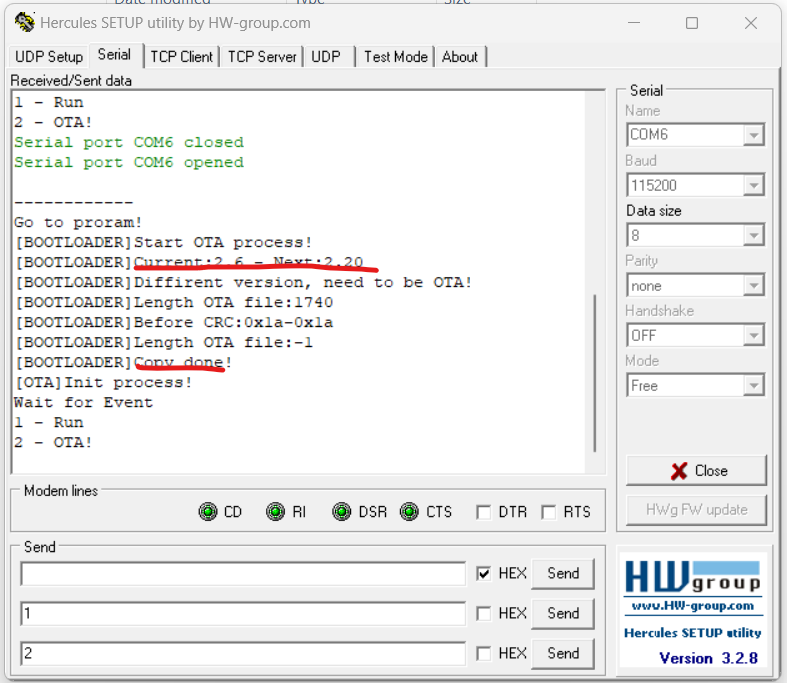

## STEP GUIDE
1. Copy the binary file to same directory of the Application.
1. Determine the COMPORT, name of binary file.
1. Using Hercules restart Board and send the **2** command to switch IC to OTA mode. Send **1** to run the program.
    
1. Close connect UART of Hercules and open Terminal at location of PC App.
1. Type command follow this guide
    
    ```shell
    run.exe <COMPORT> <File name> <MajorVerion> <MinorVersion>
    ```
    > Example: run.exe COM3 Program.bin 1 10
1. Reboot Board and view the results.
    
## Install GCC for Windows
Follow [this guide](https://www.scaler.com/topics/c/c-compiler-for-windows/) to install gcc for Windows and build program.

Build the program using **make**.
> make