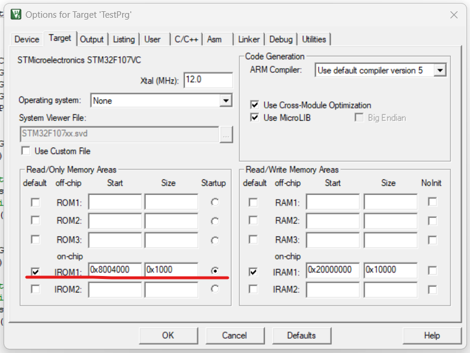
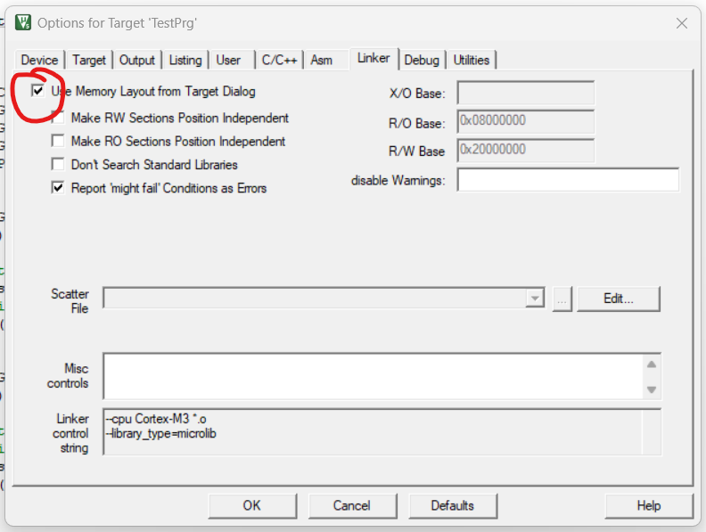
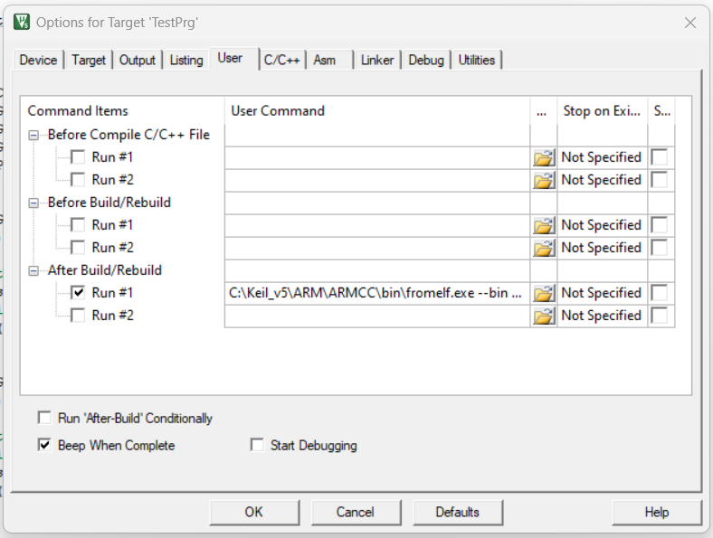

# Config Keil C for OTA
1. Edit the address in Keil C.
    
    The address must follow the address zone of Bootloader. (View the define in MemoryInterface for more details).
    
    
1. Convert the hex file to binary format
    
    ``` bash
    C:\Keil_v5\ARM\ARMCC\bin\fromelf.exe --bin Objects\TestPrg.axf --output Objects\TestPrg.bin
    ```
1. Use the binary file for the OTA PC Application. Follow [this guide](/5.PCApp/README.md/#step-guide).